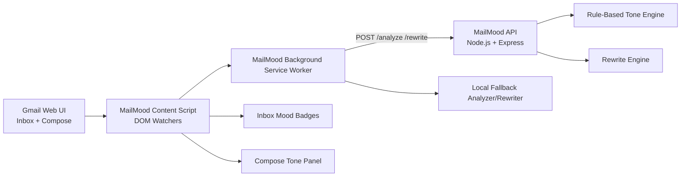

# MailMood MVP

MailMood is a browser extension + API that adds emotional intelligence to Gmail:
- Incoming mode: mood badges in inbox rows before opening messages.
- Outgoing mode: real-time compose tone panel with rewrite suggestions.
- Privacy model: process-and-forget (in-memory only, no persistent email text storage).

## 1) System Architecture Diagram



## 2) File/Folder Structure

```text
MailMood/
  docker-compose.yml
  api/
    Dockerfile
    .dockerignore
    package.json
    tsconfig.json
    src/
      analyzer.ts
      app.ts
      index.ts
      rewrite.ts
      types.ts
    test/
      analyzer.test.ts
      api.test.ts
      rewrite.test.ts
  extension/
    manifest.json
    package.json
    tsconfig.json
    scripts/
      bundle.mjs
      copy-static.mjs
    src/
      background.ts
      constants.ts
      types.ts
      lib/
        localFallback.ts
      content/
        composePanel.ts
        inbox.ts
        index.ts
        styles.css
    test/
      localFallback.test.ts
  README.md
```

## 3) Frontend Extension Code

Main files:
- `extension/manifest.json`
- `extension/src/background.ts`
- `extension/src/content/inbox.ts`
- `extension/src/content/composePanel.ts`
- `extension/src/content/index.ts`

Highlights:
- Gmail DOM watchers (`MutationObserver`) for inbox rows and compose windows.
- Non-blocking typing path via debounced tone analysis in compose mode.
- Background service worker centralizes API calls and handles graceful fallback.
- Inbox badges include color, confidence, and hover explanation.

## 4) Backend API Code

Main files:
- `api/src/index.ts`: Express server and endpoints
- `api/src/analyzer.ts`: Rule-based tone analysis
- `api/src/rewrite.ts`: Rewrite strategy stub

Endpoints:
- `GET /health`
- `POST /analyze` with `{ text, mode }`
- `POST /rewrite` with `{ text, targetTone }`

## 5) Local Run Instructions

### API
```bash
cd api
npm install
npm run dev
```
API runs on `http://localhost:8787`.

### Extension
```bash
cd extension
npm install
npm run build
```

Load unpacked extension:
- Chrome: `chrome://extensions` -> Developer mode -> Load unpacked -> select `extension/dist`
- Firefox: `about:debugging` -> This Firefox -> Load Temporary Add-on -> `extension/dist/manifest.json`

Open Gmail (`https://mail.google.com`) and test:
- Inbox rows should show mood badges.
- Compose window should show MailMood panel with analysis and rewrite actions.

## 6) Testing Plan

### Automated
```bash
cd api && npm test
cd extension && npm test
```

### Functional
- Verify inbox badges appear on initial load and after scrolling/loading more rows.
- Verify hover tooltip shows confidence + explanation.
- Type emotionally different drafts and verify compose label/emotion changes.
- Ensure typing remains responsive (no UI lock).
- Click `Rewrite`, validate suggestion appears.
- Click `Apply Rewrite`, verify compose body updates.
- Stop API server and confirm extension still returns local fallback tone/rewrite.

## 7) Deployment Notes

- Extension:
  - Build TypeScript to `extension/dist`.
  - Package `extension/dist` for Chrome Web Store / Firefox Add-ons.
  - For production API URL, update `extension/src/constants.ts` and rebuild.
- API:
  - Deploy as stateless Node service (Railway, Render, Fly.io, AWS ECS/Fargate).
  - Keep request logging minimal and never log raw email body text.
  - Enforce HTTPS and CORS restrictions in production.

### Docker (Local API)
```bash
docker compose up --build
```
This starts `mailmood-api` on `http://localhost:8787`.

## Privacy Constraints (Implemented)
- Email text processed in memory only.
- No database or file writes of email body content.
- No long-term storage in extension or API.
- Local-only fallback mode exists (background local analyzer/rewriter).
